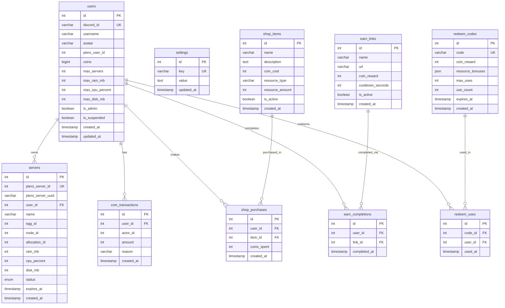
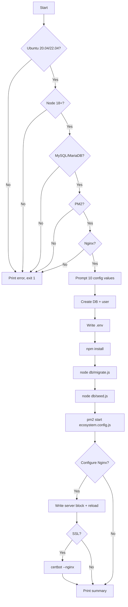

# Design Document: FreeNode Dashboard

## Overview

FreeNode Dashboard is a server-rendered Node.js web application that wraps an existing Pterodactyl panel installation. Users authenticate via Discord OAuth2, earn virtual coins through AFK farming and ad-link engagement, and spend those coins to create and renew free game/bot servers. An admin panel gives operators full control over users, servers, coins, eggs, shop items, redeem codes, and global settings.

### Technology Stack

| Layer | Technology |
|---|---|
| Runtime | Node.js 18+ |
| Web framework | Express 4 |
| Templating | EJS with `express-ejs-layouts` |
| Database | MySQL 8 / MariaDB 10.6 via `mysql2` |
| Auth | Passport.js + `passport-discord` |
| Sessions | `express-session` + `express-mysql-session` |
| HTTP client | axios (Pterodactyl API calls) |
| Scheduling | `node-cron` |
| Security | `helmet`, `csurf`, `express-rate-limit`, `express-validator` |
| Logging | `morgan` |
| Process manager | PM2 |
| Reverse proxy | Nginx |

---

## Architecture

### High-Level Component Diagram

```mermaid
graph TD
    Browser -->|HTTPS| Nginx
    Nginx -->|proxy_pass :3000| Express

    subgraph Express Application
        Express --> Middleware[Middleware Stack]
        Middleware --> Router[Route Layer]
        Router --> AuthRoutes[/auth/*]
        Router --> DashRoutes[/dashboard, /afk, /earn, /redeem, /shop]
        Router --> AdminRoutes[/admin/*]
        Router --> APIRoutes[/api/*]

        AuthRoutes --> AuthService
        DashRoutes --> CoinService
        DashRoutes --> PteroService
        AdminRoutes --> CoinService
        AdminRoutes --> PteroService
        APIRoutes --> CoinService

        CoinService --> DB[(MySQL)]
        AuthService --> DB
        PteroService -->|HTTP| PterodactylPanel[Pterodactyl Panel API]
        ExpiryService[Expiry Cron] --> PteroService
        ExpiryService --> DB
        ExpiryService -->|DM| DiscordBot[Discord Bot API]
    end
```

### Request Lifecycle

```
Browser → Nginx (TLS termination) → Express
  → morgan (logging)
  → helmet (security headers)
  → express-session (session hydration)
  → passport.initialize / passport.session
  → csurf (CSRF token)
  → express-rate-limit (per-route)
  → Route handler
  → Service layer
  → mysql2 (parameterized query)
  → EJS render / JSON response
```

### Directory Structure

```
freenode-dashboard/
├── app.js                    # Express app factory
├── server.js                 # HTTP server entry point
├── ecosystem.config.js       # PM2 config
├── install.sh                # Interactive installer
├── .env.example
├── config/
│   ├── database.js           # mysql2 pool factory
│   ├── passport.js           # Passport Discord strategy
│   └── session.js            # Session store config
├── middleware/
│   ├── auth.js               # isAuthenticated, isAdmin guards
│   ├── csrf.js               # CSRF token injection
│   └── rateLimiter.js        # Named rate limiter instances
├── routes/
│   ├── auth.js               # /auth/discord, /auth/callback, /auth/logout
│   ├── dashboard.js          # /dashboard
│   ├── server.js             # /servers/create, /servers/:id/renew
│   ├── afk.js                # /afk, /afk/ping, /afk/captcha-verify
│   ├── earn.js               # /earn, /earn/:id/start, /earn/:id/verify
│   ├── redeem.js             # /redeem
│   ├── shop.js               # /shop, /shop/buy
│   └── admin/
│       ├── index.js          # Admin router aggregator
│       ├── users.js          # /admin/users
│       ├── servers.js        # /admin/servers
│       ├── eggs.js           # /admin/eggs
│       ├── codes.js          # /admin/codes
│       ├── coins.js          # /admin/coins
│       └── settings.js       # /admin/settings
├── services/
│   ├── pterodactylService.js
│   ├── coinService.js
│   ├── authService.js
│   ├── afkService.js
│   ├── earnService.js
│   ├── redeemService.js
│   ├── shopService.js
│   ├── expiryService.js      # cron job
│   └── discordService.js     # Bot DM sender
├── db/
│   ├── migrate.js            # Creates all tables
│   └── seed.js               # Seeds default settings
├── views/
│   ├── layouts/
│   │   ├── main.ejs          # Authenticated layout (sidebar)
│   │   └── auth.ejs          # Unauthenticated layout
│   ├── partials/
│   │   ├── sidebar.ejs
│   │   ├── navbar.ejs
│   │   └── flash.ejs
│   ├── index.ejs             # Login page
│   ├── dashboard.ejs
│   ├── servers/
│   │   └── create.ejs
│   ├── afk.ejs
│   ├── earn.ejs
│   ├── redeem.ejs
│   ├── shop.ejs
│   └── admin/
│       ├── users.ejs
│       ├── servers.ejs
│       ├── eggs.ejs
│       ├── codes.ejs
│       ├── coins.ejs
│       └── settings.ejs
└── public/
    ├── css/
    │   ├── theme.css         # CSS variables, dark theme
    │   ├── layout.css        # Sidebar, navbar, grid
    │   └── components.css    # Cards, buttons, forms
    └── js/
        ├── afk.js            # AFK ping loop + CAPTCHA UI
        └── sidebar.js        # Collapsible sidebar toggle
```

---

## Components and Interfaces

### Middleware Stack (`middleware/`)

#### `auth.js`

```js
// isAuthenticated(req, res, next) — redirects to / if not logged in
// isAdmin(req, res, next) — returns HTTP 403 if user.is_admin is false
```

#### `rateLimiter.js`

Named limiter instances exported for use in specific routes:

| Name | Window | Max requests | Applied to |
|---|---|---|---|
| `authLimiter` | 15 min | 20 | `/auth/*` |
| `afkLimiter` | 70 sec | 2 | `/afk/ping` |
| `earnLimiter` | 1 hour | 10 | `/earn/:id/start` |
| `redeemLimiter` | 10 min | 5 | `/redeem` POST |

#### `csrf.js`

Injects `res.locals.csrfToken` for all GET requests; validates token on POST/PUT/PATCH/DELETE.

---

### Service Layer (`services/`)

#### `pterodactylService.js`

Axios instance with `baseURL = PTERODACTYL_URL`, `timeout = 10000`.

```
createUser(email, username, password) → PteroUser
deleteUser(pteroUserId) → void
createServer(opts) → PteroServer
suspendServer(serverId) → void
unsuspendServer(serverId) → void
deleteServer(serverId) → void
reinstallServer(serverId) → void
getServerDetails(serverId) → PteroServer
getAllNodes() → Node[]
getAllNests() → Nest[]
getAllEggs(nestId) → Egg[]
getAvailableAllocations(nodeId) → Allocation[]
getServerResourceUsage(serverUuid) → ResourceStats
```

Application API key used for all except `getServerResourceUsage` which uses the Client API key. All 4xx/5xx responses throw `PterodactylError { status, message, operation }`.

#### `coinService.js`

```
credit(userId, amount, reason, actorId?) → newBalance
debit(userId, amount, reason, actorId?) → newBalance   // throws if insufficient
getBalance(userId) → number
getTransactions(userId, page, limit) → CoinTransaction[]
broadcastCredit(amount, reason, actorId) → void
```

All mutations write a row to `coin_transactions`. Uses a DB transaction to ensure atomicity of balance update + transaction record.

#### `authService.js`

Passport strategy configuration. On successful OAuth2 callback:
1. Verify guild membership (if `REQUIRED_GUILD_ID` set)
2. Upsert user record
3. Create Pterodactyl account on first login

#### `afkService.js`

```
handlePing(userId, sessionData) → { balance, remaining, captchaRequired }
verifyCaptcha(userId, token) → { success }
```

Tracks per-user daily earned coins in `coin_transactions` (summed by date). CAPTCHA state stored in session.

#### `earnService.js`

```
getLinksForUser(userId) → EarnLink[]   // includes cooldown status
startEarn(userId, linkId) → { redirectUrl }
verifyEarn(userId, linkId, token) → { balance }
```

#### `redeemService.js`

```
redeem(userId, code) → { coins, resources }
```

Validates existence, expiry, max uses, per-user uniqueness, then calls `coinService.credit` and updates resource limits in a single DB transaction.

#### `shopService.js`

```
getItems() → ShopItem[]
purchase(userId, itemId) → { newLimits }
```

Uses DB transaction: debit coins → update resource limits → record purchase. Refunds on failure.

#### `expiryService.js`

`node-cron` schedule `*/15 * * * *`:
1. Suspend all active servers past expiry → update status
2. Delete all suspended servers past grace period → remove record
3. Send Discord DM on suspension (if bot token configured)

#### `discordService.js`

```
sendDM(discordUserId, message) → void
```

Uses Discord REST API with `DISCORD_BOT_TOKEN`. Fire-and-forget with error logging.

---

## Data Models

### Entity Relationship Diagram



### Table Definitions

#### `users`

| Column | Type | Notes |
|---|---|---|
| `id` | INT AUTO_INCREMENT PK | |
| `discord_id` | VARCHAR(20) UNIQUE NOT NULL | |
| `username` | VARCHAR(100) NOT NULL | |
| `avatar` | VARCHAR(100) | Hash for CDN URL |
| `ptero_user_id` | INT | Pterodactyl user ID |
| `coins` | BIGINT DEFAULT 0 | |
| `max_servers` | INT DEFAULT 2 | |
| `max_ram_mb` | INT DEFAULT 1024 | |
| `max_cpu_percent` | INT DEFAULT 100 | |
| `max_disk_mb` | INT DEFAULT 5120 | |
| `is_admin` | BOOLEAN DEFAULT FALSE | |
| `is_suspended` | BOOLEAN DEFAULT FALSE | |
| `created_at` | TIMESTAMP DEFAULT NOW() | |
| `updated_at` | TIMESTAMP ON UPDATE NOW() | |

#### `servers`

| Column | Type | Notes |
|---|---|---|
| `id` | INT AUTO_INCREMENT PK | |
| `ptero_server_id` | INT UNIQUE NOT NULL | |
| `ptero_server_uuid` | VARCHAR(36) | |
| `user_id` | INT FK → users.id | |
| `name` | VARCHAR(100) | |
| `egg_id` | INT | |
| `node_id` | INT | |
| `allocation_id` | INT | |
| `ram_mb` | INT | |
| `cpu_percent` | INT | |
| `disk_mb` | INT | |
| `status` | ENUM('active','suspended','deleted') DEFAULT 'active' | |
| `expires_at` | TIMESTAMP NOT NULL | |
| `created_at` | TIMESTAMP DEFAULT NOW() | |

#### `coin_transactions`

| Column | Type | Notes |
|---|---|---|
| `id` | INT AUTO_INCREMENT PK | |
| `user_id` | INT FK → users.id | Recipient |
| `actor_id` | INT NULL | Admin user ID or NULL for system |
| `amount` | INT NOT NULL | Positive = credit, negative = debit |
| `reason` | VARCHAR(255) | |
| `created_at` | TIMESTAMP DEFAULT NOW() | |

#### `settings`

Default keys seeded by installer:

| Key | Default |
|---|---|
| `creation_cost` | `100` |
| `renewal_cost` | `50` |
| `renewal_period_days` | `7` |
| `deletion_grace_days` | `3` |
| `afk_coins_per_ping` | `1` |
| `afk_daily_limit` | `100` |
| `afk_captcha_interval_minutes` | `10` |
| `max_servers_per_user` | `2` |
| `default_ram_mb` | `1024` |
| `default_cpu_percent` | `100` |
| `default_disk_mb` | `5120` |
| `enabled_egg_ids` | `[]` (JSON array) |

#### `shop_items`

| Column | Type |
|---|---|
| `id` | INT AUTO_INCREMENT PK |
| `name` | VARCHAR(100) |
| `description` | TEXT |
| `coin_cost` | INT |
| `resource_type` | ENUM('ram','cpu','disk','servers') |
| `resource_amount` | INT |
| `is_active` | BOOLEAN DEFAULT TRUE |
| `created_at` | TIMESTAMP DEFAULT NOW() |

#### `earn_links`

| Column | Type |
|---|---|
| `id` | INT AUTO_INCREMENT PK |
| `name` | VARCHAR(100) |
| `url` | VARCHAR(500) |
| `coin_reward` | INT |
| `cooldown_seconds` | INT |
| `is_active` | BOOLEAN DEFAULT TRUE |
| `created_at` | TIMESTAMP DEFAULT NOW() |

#### `redeem_codes`

| Column | Type |
|---|---|
| `id` | INT AUTO_INCREMENT PK |
| `code` | VARCHAR(64) UNIQUE NOT NULL |
| `coin_reward` | INT DEFAULT 0 |
| `resource_bonuses` | JSON NULL |
| `max_uses` | INT NULL | NULL = unlimited |
| `use_count` | INT DEFAULT 0 |
| `expires_at` | TIMESTAMP NULL |
| `created_at` | TIMESTAMP DEFAULT NOW() |

---

## API / Route Design

### Authentication Routes (`routes/auth.js`)

| Method | Path | Description |
|---|---|---|
| GET | `/auth/discord` | Redirect to Discord OAuth2 |
| GET | `/auth/discord/callback` | OAuth2 callback handler |
| GET | `/auth/logout` | Destroy session, redirect to `/` |

### User-Facing Routes

| Method | Path | Auth | Description |
|---|---|---|---|
| GET | `/` | No | Login page |
| GET | `/dashboard` | Yes | Dashboard home |
| GET | `/servers/create` | Yes | Server creation form |
| POST | `/servers/create` | Yes | Submit server creation |
| POST | `/servers/:id/renew` | Yes | Renew server |
| GET | `/afk` | Yes | AFK page |
| POST | `/afk/ping` | Yes | AFK coin ping (rate limited) |
| POST | `/afk/captcha-verify` | Yes | CAPTCHA verification |
| GET | `/earn` | Yes | Earn links page |
| POST | `/earn/:id/start` | Yes | Start earn link (rate limited) |
| POST | `/earn/:id/verify` | Yes | Verify earn completion |
| GET | `/redeem` | Yes | Redeem page |
| POST | `/redeem` | Yes | Submit redeem code (rate limited) |
| GET | `/shop` | Yes | Shop page |
| POST | `/shop/buy` | Yes | Purchase shop item |

### Admin Routes (`routes/admin/`)

All routes require `isAdmin` middleware returning HTTP 403 if not admin.

| Method | Path | Description |
|---|---|---|
| GET | `/admin` | Admin dashboard overview |
| GET | `/admin/users` | Paginated user list |
| GET | `/admin/users/:id` | User detail |
| POST | `/admin/users/:id/coins` | Adjust coin balance |
| POST | `/admin/users/:id/suspend` | Suspend user |
| POST | `/admin/users/:id/unsuspend` | Unsuspend user |
| DELETE | `/admin/users/:id` | Delete user |
| GET | `/admin/servers` | Paginated server list |
| POST | `/admin/servers/:id/suspend` | Suspend server |
| POST | `/admin/servers/:id/unsuspend` | Unsuspend server |
| DELETE | `/admin/servers/:id` | Delete server |
| POST | `/admin/servers/:id/extend` | Extend expiry |
| POST | `/admin/servers/:id/reinstall` | Reinstall server |
| GET | `/admin/eggs` | Egg configuration |
| POST | `/admin/eggs/:id/enable` | Enable egg |
| POST | `/admin/eggs/:id/disable` | Disable egg |
| POST | `/admin/eggs/:id/defaults` | Set egg defaults |
| GET | `/admin/codes` | Redeem code list |
| POST | `/admin/codes` | Create redeem code |
| POST | `/admin/codes/bulk` | Bulk generate codes |
| POST | `/admin/codes/:id/deactivate` | Deactivate code |
| GET | `/admin/coins` | Coin transaction log |
| POST | `/admin/coins/give` | Give/take coins from user |
| POST | `/admin/coins/broadcast` | Broadcast coins to all users |
| GET | `/admin/settings` | Settings form |
| POST | `/admin/settings` | Save settings |

---

## UI/UX Architecture

### EJS Layout System

Two layouts via `express-ejs-layouts`:

- `layouts/auth.ejs` — minimal centered card, used for login page
- `layouts/main.ejs` — full authenticated layout with collapsible sidebar + top navbar

### CSS Architecture

CSS custom properties defined in `theme.css`:

```css
:root {
  --bg-primary: #0d0f14;
  --bg-card: #161922;
  --accent: #5865F2;
  --success: #57F287;
  --warning: #FEE75C;
  --danger: #ED4245;
  --font-primary: 'Outfit', 'Plus Jakarta Sans', sans-serif;
  --font-secondary: 'Inter', sans-serif;
}
```

Page-specific accent overrides applied via body class:
- `.page-afk` → deep space tones (`#1a1a2e`, `#16213e`)
- `.page-shop` → gold tones (`#f0c040`, `#b8860b`)
- `.page-earn` → green tones (`#57F287`, `#2d6a4f`)
- `.page-redeem` → purple tones (`#9b59b6`, `#6c3483`)

### Sidebar Navigation

Collapsible via CSS class toggle (`sidebar--collapsed`) controlled by `sidebar.js`. State persisted in `localStorage`. Sidebar items: Dashboard, Servers, AFK, Earn, Redeem, Shop, (Admin section if admin).

### Glassmorphism Cards

```css
.card-glass {
  background: rgba(22, 25, 34, 0.7);
  backdrop-filter: blur(12px);
  border: 1px solid rgba(255,255,255,0.08);
  border-radius: 12px;
}
```

---

## Security Architecture

### Defense in Depth

```
Layer 1: Nginx — TLS, rate limiting at proxy level
Layer 2: helmet — CSP, HSTS, X-Frame-Options, etc.
Layer 3: express-rate-limit — per-route IP-based limits
Layer 4: csurf — CSRF token on all state-changing requests
Layer 5: isAuthenticated / isAdmin middleware — route guards
Layer 6: express-validator — input validation and sanitization
Layer 7: mysql2 parameterized queries — SQL injection prevention
Layer 8: Session stored in MySQL — no client-side state
```

### Environment Variable Security

- `.env` never committed (`.gitignore`)
- API keys never passed to EJS templates or JSON responses
- `pterodactylService.js` is the only file that reads API key env vars

### Admin Authorization

`isAdmin` middleware checks `req.user.is_admin` on every `/admin/*` request. Admin IDs from `ADMIN_DISCORD_IDS` env var are synced to the DB flag on login.

### Session Security

```js
session({
  secret: process.env.SESSION_SECRET,
  resave: false,
  saveUninitialized: false,
  cookie: {
    secure: process.env.NODE_ENV === 'production',
    httpOnly: true,
    sameSite: 'lax',
    maxAge: 7 * 24 * 60 * 60 * 1000
  }
})
```

---

## Deployment Architecture

### PM2 (`ecosystem.config.js`)

```js
module.exports = {
  apps: [{
    name: 'freenode-dashboard',
    script: 'server.js',
    instances: 1,
    max_memory_restart: '300M',
    env_production: {
      NODE_ENV: 'production',
      PORT: 3000
    }
  }]
}
```

### Nginx Configuration

```nginx
server {
    listen 80;
    server_name <DASHBOARD_URL>;

    location / {
        proxy_pass http://127.0.0.1:3000;
        proxy_http_version 1.1;
        proxy_set_header Upgrade $http_upgrade;
        proxy_set_header Connection 'upgrade';
        proxy_set_header Host $host;
        proxy_set_header X-Real-IP $remote_addr;
        proxy_set_header X-Forwarded-For $proxy_add_x_forwarded_for;
        proxy_set_header X-Forwarded-Proto $scheme;
        proxy_cache_bypass $http_upgrade;
    }
}
```

SSL added by Certbot (`certbot --nginx -d <DASHBOARD_URL>`).

### Installer Flow (`install.sh`)



---


## Correctness Properties

*A property is a characteristic or behavior that should hold true across all valid executions of a system — essentially, a formal statement about what the system should do. Properties serve as the bridge between human-readable specifications and machine-verifiable correctness guarantees.*

### Property 1: New user record defaults

*For any* new Discord user completing OAuth2 for the first time, the inserted `users` record should have `coins = 0`, `is_admin = false`, `is_suspended = false`, and resource limits equal to the default values from Settings.

**Validates: Requirements 2.6**

---

### Property 2: Returning user profile sync

*For any* returning user whose Discord username or avatar has changed since last login, after authentication the `users` record should reflect the new username and avatar values.

**Validates: Requirements 2.7**

---

### Property 3: Guild membership enforcement

*For any* Discord user who is not a member of the configured `REQUIRED_GUILD_ID`, the OAuth2 callback should not create a session and should redirect to the login page with an error.

**Validates: Requirements 2.3, 2.4**

---

### Property 4: Logout invalidates session

*For any* authenticated user, after a POST to `/auth/logout` the previous session ID should no longer resolve to an authenticated session.

**Validates: Requirements 2.9**

---

### Property 5: Suspended user cannot authenticate

*For any* user with `is_suspended = true`, the OAuth2 callback should not create a session and should redirect to the login page with a suspension notice.

**Validates: Requirements 2.10**

---

### Property 6: Server creation slot validation

*For any* user whose current server count equals or exceeds their `max_servers` limit, a server creation request should be rejected with an error identifying the slot limit.

**Validates: Requirements 4.1**

---

### Property 7: Server creation coin validation

*For any* user whose `coins` balance is less than the `creation_cost` setting, a server creation request should be rejected with an error identifying the coin shortfall.

**Validates: Requirements 4.2**

---

### Property 8: Server creation egg validation

*For any* egg ID not present in the `enabled_egg_ids` settings list, a server creation request should be rejected with an error identifying the invalid egg.

**Validates: Requirements 4.3**

---

### Property 9: Server creation resource validation

*For any* server creation request where the requested RAM, CPU, or disk exceeds the user's remaining resource allowance (limit minus already-allocated), the request should be rejected with an error identifying the exceeded resource.

**Validates: Requirements 4.4**

---

### Property 10: Server creation coin atomicity

*For any* server creation attempt, coins should be deducted if and only if the Pterodactyl API confirms successful server creation — a Pterodactyl API error should leave the user's balance unchanged.

**Validates: Requirements 4.8, 4.11**

---

### Property 11: Server record on creation

*For any* successfully created server, the `servers` record should have `user_id` matching the requesting user, `status = 'active'`, and `expires_at` equal to `now + renewal_period_days`.

**Validates: Requirements 4.9**

---

### Property 12: Renewal ownership check

*For any* renewal request where the server's `user_id` does not match the requesting user's ID, the renewal should be rejected.

**Validates: Requirements 5.1**

---

### Property 13: Renewal coin deduction and expiry extension

*For any* successful server renewal, the user's coin balance should decrease by exactly `renewal_cost` and the server's `expires_at` should increase by exactly `renewal_period_days` from its previous value.

**Validates: Requirements 5.2, 5.4, 5.5**

---

### Property 14: Expiry cron selects correct servers

*For any* set of server records, the expiry cron's suspension query should return exactly those records where `status = 'active'` AND `expires_at < NOW()`, and the deletion query should return exactly those where `status = 'suspended'` AND `expires_at < NOW() - deletion_grace_days`.

**Validates: Requirements 6.2, 6.5**

---

### Property 15: Expiry cron status update

*For any* server that the expiry cron successfully suspends via Pterodactyl, the `servers` record should have `status = 'suspended'` after the cron run.

**Validates: Requirements 6.4**

---

### Property 16: Expiry cron error isolation

*For any* Pterodactyl API error during expiry processing of one server, the cron job should continue processing all remaining servers in the batch.

**Validates: Requirements 6.9**

---

### Property 17: AFK daily limit enforcement

*For any* user whose AFK coin earnings today (sum of `coin_transactions` with reason `'afk'` since midnight) equals or exceeds `afk_daily_limit`, a ping should not credit any coins and should return a limit-reached response.

**Validates: Requirements 7.2, 7.5**

---

### Property 18: AFK coin credit amount

*For any* user under the daily AFK limit, a valid ping should increase the user's coin balance by exactly `afk_coins_per_ping`.

**Validates: Requirements 7.3**

---

### Property 19: AFK CAPTCHA state machine

*For any* user who has been pinging for at least `afk_captcha_interval_minutes` without solving a CAPTCHA, the next ping response should include `captchaRequired: true` and should not credit coins. After the user submits a correct CAPTCHA token, the challenge state should be cleared and subsequent pings should resume crediting coins. An incorrect CAPTCHA token should leave the challenge state active.

**Validates: Requirements 7.6, 7.7, 7.8, 7.9**

---

### Property 20: Earn link cooldown enforcement

*For any* user whose last `earn_completions` record for a given link is within that link's `cooldown_seconds`, starting that earn link should be rejected with the remaining cooldown time.

**Validates: Requirements 8.2, 8.3**

---

### Property 21: Earn coin credit and cooldown recording

*For any* valid earn completion (valid token), the user's balance should increase by exactly the link's `coin_reward`, and a new `earn_completions` record should be created, making the link unavailable until the cooldown expires.

**Validates: Requirements 8.6, 8.7**

---

### Property 22: Earn invalid token rejects without credit

*For any* invalid earn completion token, the user's coin balance should remain unchanged.

**Validates: Requirements 8.8**

---

### Property 23: Redeem code case-insensitive lookup

*For any* redeem code string, submitting it in any combination of upper and lower case should produce the same result as submitting it in its stored case.

**Validates: Requirements 9.1**

---

### Property 24: Redeem code validation failures

*For any* redeem attempt where the code does not exist, has expired, has reached max uses, or has already been used by the requesting user, the redemption should fail with a descriptive error and the user's balance should remain unchanged.

**Validates: Requirements 9.2, 9.3, 9.4, 9.5**

---

### Property 25: Successful redemption atomicity

*For any* valid redeem code redemption, the user's balance should increase by exactly `coin_reward`, resource limits should increase by the `resource_bonuses` amounts, the code's `use_count` should increment by 1, and a `redeem_uses` record should be created — all in a single atomic operation.

**Validates: Requirements 9.6, 9.7, 9.8**

---

### Property 26: Shop only returns active items

*For any* shop page load, the returned items should contain only those with `is_active = true`.

**Validates: Requirements 10.1**

---

### Property 27: Shop purchase coin and resource atomicity

*For any* successful shop purchase, the user's balance should decrease by exactly `item.coin_cost` and the user's resource limit for `item.resource_type` should increase by `item.resource_amount`. If the database update fails after coin deduction, the balance should be fully restored.

**Validates: Requirements 10.2, 10.4, 10.5, 10.7**

---

### Property 28: Admin user search filtering

*For any* admin user search query, all returned user records should have a `username` or `discord_id` that matches the query string (case-insensitive substring match).

**Validates: Requirements 11.2**

---

### Property 29: Admin coin adjustment transaction recording

*For any* admin coin adjustment (give or take), a `coin_transactions` record should be created with `actor_id` equal to the admin's user ID, `amount` equal to the delta, and the user's balance should reflect the change.

**Validates: Requirements 11.3, 15.1**

---

### Property 30: User suspend/unsuspend round trip

*For any* user, suspending then unsuspending should result in `is_suspended = false`, and the user should be able to authenticate again.

**Validates: Requirements 11.4, 11.5**

---

### Property 31: User deletion cascades

*For any* deleted user, no `servers` records with that `user_id` should remain in the database after deletion.

**Validates: Requirements 11.6**

---

### Property 32: Admin route authorization

*For any* request to any `/admin/*` route from a user with `is_admin = false` or an unauthenticated user, the response should be HTTP 403.

**Validates: Requirements 11.7, 18.8**

---

### Property 33: Bulk code uniqueness

*For any* bulk code generation of N codes, all N generated code strings should be unique.

**Validates: Requirements 14.2**

---

### Property 34: Code deactivation prevents redemption

*For any* redeem code that has been deactivated (max_uses set to use_count), subsequent redemption attempts should fail with a fully-redeemed error.

**Validates: Requirements 14.3**

---

### Property 35: Coin broadcast credits all users

*For any* admin coin broadcast of amount X, every user record in the database should have their balance increased by exactly X, and a `coin_transactions` record should exist for each user.

**Validates: Requirements 15.2**

---

### Property 36: Settings validation rejects invalid values

*For any* settings save request containing a non-positive number in a numeric field or a malformed string in a URL field, the request should be rejected with field-specific error messages and the Settings table should remain unchanged.

**Validates: Requirements 16.2, 16.3**

---

### Property 37: Settings round trip

*For any* valid settings save, reading the Settings table immediately after should return the saved values.

**Validates: Requirements 16.4**

---

### Property 38: Pterodactyl API key routing

*For any* call to `getServerResourceUsage`, the outbound HTTP request should use the Client API key in the Authorization header; for all other Pterodactyl_Service operations, the Application API key should be used.

**Validates: Requirements 17.2**

---

### Property 39: Pterodactyl structured error

*For any* HTTP 4xx or 5xx response from the Pterodactyl API, the thrown error object should contain `status` (HTTP code), `message` (Pterodactyl error text), and `operation` (the name of the calling method).

**Validates: Requirements 17.3**

---

### Property 40: No API keys in responses

*For any* HTTP response from any route, the response body should not contain the `PTERODACTYL_APP_KEY`, `PTERODACTYL_CLIENT_KEY`, `SESSION_SECRET`, or `DB_PASSWORD` environment variable values.

**Validates: Requirements 17.4, 18.7**

---

### Property 41: CSRF protection on state-changing requests

*For any* POST, PUT, PATCH, or DELETE request that does not include a valid CSRF token, the response should be HTTP 403 (CSRF error).

**Validates: Requirements 18.2**

---

### Property 42: Input validation rejects malicious payloads

*For any* user-supplied input containing XSS payloads (e.g., `<script>` tags) or SQL injection patterns, `express-validator` should either reject the request or sanitize the input before it reaches the service layer.

**Validates: Requirements 18.6**

---

## Error Handling

### Error Categories

| Category | Handling Strategy |
|---|---|
| Pterodactyl API errors | Throw `PterodactylError`, catch in route handler, return user-friendly message |
| Validation errors | `express-validator` result array, re-render form with field errors |
| Insufficient coins | `CoinError` thrown by `coinService.debit`, caught in route, return 400 |
| Auth failures | Passport failure redirect to `/` with flash message |
| CSRF errors | `csurf` error handler returns 403 |
| Rate limit exceeded | `express-rate-limit` returns 429 with Retry-After header |
| DB errors | Caught in service layer, logged, return 500 |
| Unhandled errors | Express error middleware: log stack in dev, generic message in prod |

### Production Error Middleware

```js
// app.js
app.use((err, req, res, next) => {
  if (process.env.NODE_ENV === 'production') {
    console.error(err); // goes to PM2 log
    res.status(500).render('error', { message: 'Something went wrong.' });
  } else {
    res.status(500).send(`<pre>${err.stack}</pre>`);
  }
});
```

### Coin Operation Atomicity

All coin mutations use a DB transaction:

```js
// coinService.js pattern
const conn = await pool.getConnection();
await conn.beginTransaction();
try {
  await conn.query('UPDATE users SET coins = coins + ? WHERE id = ?', [amount, userId]);
  await conn.query('INSERT INTO coin_transactions ...', [...]);
  await conn.commit();
} catch (e) {
  await conn.rollback();
  throw e;
} finally {
  conn.release();
}
```

---

## Testing Strategy

### Dual Testing Approach

Both unit tests and property-based tests are required. They are complementary:

- Unit tests catch concrete bugs with specific inputs and verify integration points
- Property tests verify universal correctness across randomized inputs

### Property-Based Testing Library

**Target language**: JavaScript/Node.js  
**Library**: [`fast-check`](https://github.com/dubzzz/fast-check)

Install: `npm install --save-dev fast-check`

Each property test must run a minimum of **100 iterations** (fast-check default is 100).

### Property Test Tag Format

Each property test must include a comment referencing the design property:

```js
// Feature: freenode-dashboard, Property 10: Server creation coin atomicity
```

### Property Test Examples

```js
import fc from 'fast-check';
import { coinService } from '../services/coinService.js';

// Feature: freenode-dashboard, Property 18: AFK coin credit amount
test('AFK ping credits exactly afk_coins_per_ping', () => {
  fc.assert(
    fc.property(
      fc.integer({ min: 0, max: 99 }), // coins earned today (under limit)
      fc.integer({ min: 1, max: 10 }),  // afk_coins_per_ping setting
      (earnedToday, coinsPerPing) => {
        const result = afkService.calculateCredit(earnedToday, 100, coinsPerPing);
        return result.credited === coinsPerPing;
      }
    ),
    { numRuns: 100 }
  );
});

// Feature: freenode-dashboard, Property 25: Successful redemption atomicity
test('Redemption atomically updates balance, resources, and use_count', () => {
  fc.assert(
    fc.property(
      fc.record({
        coinReward: fc.integer({ min: 1, max: 10000 }),
        resourceBonuses: fc.record({ ram: fc.integer({ min: 0, max: 4096 }) }),
        initialBalance: fc.integer({ min: 0, max: 100000 }),
      }),
      async ({ coinReward, resourceBonuses, initialBalance }) => {
        // set up test DB state, call redeemService.redeem, verify all side effects
      }
    ),
    { numRuns: 100 }
  );
});
```

### Unit Test Focus Areas

Unit tests should cover:

- Specific examples: valid server creation flow, successful OAuth2 callback
- Integration points: Pterodactyl service mock responses, session store behavior
- Edge cases: zero-coin balance, expired codes, suspended users
- Error conditions: Pterodactyl 500 response, DB connection failure

### Test File Structure

```
tests/
├── unit/
│   ├── coinService.test.js
│   ├── redeemService.test.js
│   ├── afkService.test.js
│   ├── earnService.test.js
│   ├── shopService.test.js
│   ├── expiryService.test.js
│   └── pterodactylService.test.js
├── property/
│   ├── coinService.property.test.js    # Properties 10, 13, 17, 18, 29, 35
│   ├── redeemService.property.test.js  # Properties 23, 24, 25, 34
│   ├── afkService.property.test.js     # Properties 17, 18, 19
│   ├── earnService.property.test.js    # Properties 20, 21, 22
│   ├── shopService.property.test.js    # Properties 26, 27
│   ├── expiryService.property.test.js  # Properties 14, 15, 16
│   ├── authService.property.test.js    # Properties 1, 2, 3, 4, 5
│   ├── adminRoutes.property.test.js    # Properties 28, 29, 30, 31, 32, 33
│   └── security.property.test.js      # Properties 40, 41, 42
└── integration/
    ├── auth.test.js
    ├── serverCreation.test.js
    └── installer.test.sh
```

### Coverage Targets

| Layer | Target |
|---|---|
| Service layer | 90% line coverage |
| Route handlers | 80% line coverage |
| Property tests | 1 test per correctness property (42 total) |
